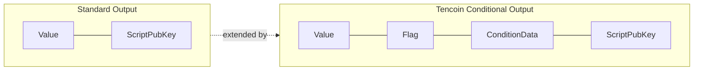
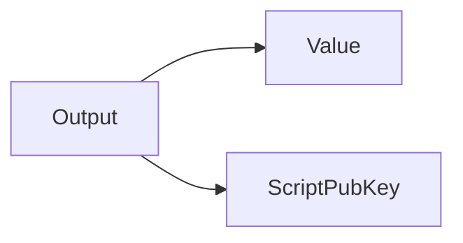
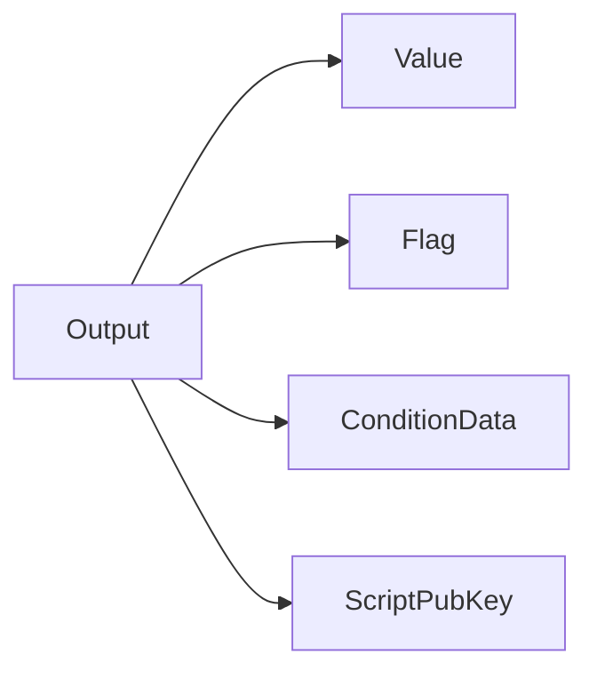
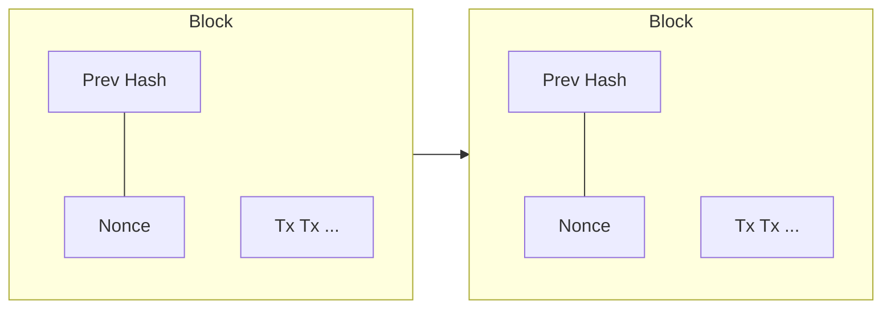
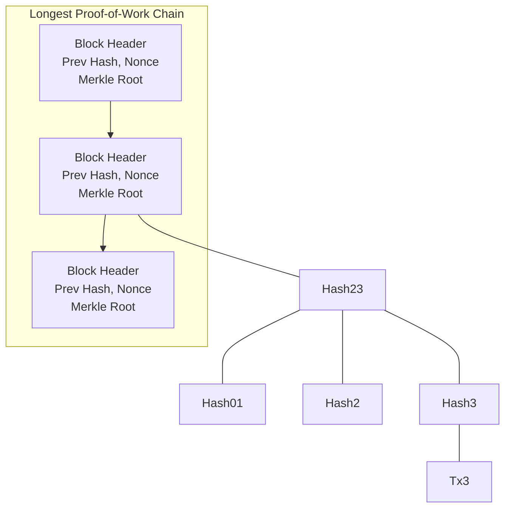
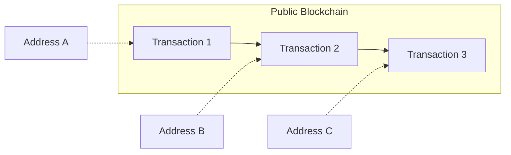

# Tencoin: A Peer-to-Peer Electronic Cash System with Native Conditional Transactions

**A. Sh**
a.sh@tencoin.org
www.tencoin.org

## Abstract

Electronic payments often require conditions such as delayed release, secret-based redemption, or refundable transfers. Existing systems typically implement these functions through specialized scripts, alternative address constructions, or external execution environments. Tencoin extends the UTXO model with Native Conditional Outputs, allowing transaction conditions to be stored directly within transaction outputs and enforced by consensus rules. Timelocks, Hashlocks, and refundable payments can be created without modifying recipient addresses or requiring custom script construction. The system preserves the security and decentralization of Proof-of-Work while integrating commonly used transaction conditions directly into the transaction model. By making conditional transfers a native feature of the protocol, Tencoin enables secure peer-to-peer agreements, delayed settlements, verification-code protected transfers, and refundable payments without relying on trusted third parties.

## 1. Introduction

Bitcoin demonstrated that a decentralized peer-to-peer network secured by Proof-of-Work can eliminate trusted intermediaries while preserving ownership through the UTXO model. Many transactions require conditions beyond simple ownership transfer. Funds may need to remain locked until a specified time, require knowledge of a secret for redemption, or become refundable under predefined circumstances. Existing systems implement such conditions through specialized scripts or external execution environments, increasing complexity for common payment scenarios. Tencoin addresses these challenges by extending the UTXO model with Native Conditional Outputs. Transaction conditions are stored directly within transaction outputs and enforced by consensus rules. Timelocks, Hashlocks, and refundable transfers can be created without specialized script construction or changes to recipient address formats. The network preserves the security properties of Proof-of-Work. As long as honest participants control the majority of network hash power, they will generate the longest chain and outpace attackers. Tencoin enables conditional value transfers directly within the transaction model, without reliance on trusted third parties.

## 2. Native Conditional Outputs

Tencoin extends the traditional UTXO model by introducing Native Conditional Outputs. A transaction output may optionally contain condition data that defines additional consensus-enforced spending requirements.

Unlike script-based constructions, where spending conditions are embedded within redeem scripts, Native Conditional Outputs store commonly used transaction conditions directly within the output itself. These conditions are evaluated by all validating nodes during transaction verification and form part of the consensus rules of the network.

Native Conditional Outputs are independent of the recipient address format. Transaction conditions specify additional spending requirements, while ownership remains defined by the destination address. As a result, conditional transfers can be enforced without altering the existing ownership model.

Tencoin extends the standard output structure with native conditions that control when and how an output may be spent.

## 3. Transactions

Tencoin uses the Unspent Transaction Output (UTXO) model introduced by Bitcoin. Each transaction consumes one or more existing outputs and creates one or more new outputs. Ownership of an output is defined by the destination script and may be transferred only by satisfying the spending requirements associated with that script. A standard transaction output contains a value and a destination script. The value specifies the amount assigned to the output, while the destination script defines the ownership rules required for spending it. In the absence of additional conditions, an output may be spent once the destination script requirements are satisfied.

**Output**

Tencoin extends this model through Native Conditional Outputs. In addition to ownership rules, an output may contain consensus-enforced spending conditions that must be satisfied before it becomes spendable. These conditions are stored directly within the output structure and are validated by all nodes as part of consensus. Each conditional output contains a value, a condition identifier, optional condition data, and a destination script. The destination script continues to define ownership, while the condition fields define any additional requirements that must be satisfied before the output may be spent.

**Output**

A condition flag of 0x00 indicates a standard output with no additional conditions. Other condition flags introduce native conditional behaviors such as timelocks, hashlocks, refundable transfers, and combinations thereof.

The spending requirements of an output are determined by both the ownership rules defined by the destination script and the conditions specified by the output itself. A transaction is considered valid only if all applicable conditions are satisfied. By separating ownership from spending conditions, Tencoin allows conditional transfers to be created without requiring specialized address formats. Native conditional rules may be applied to any supported destination script.

The following sections describe each native conditional output type and the validation rules that enforce them.

| Flag | Native Condition |
|------|-------------------|
| 0xC1 | Timelock |
| 0xC2 | Hashlock |
| 0xC3 | Timelock + Hashlock |
| 0xC4 | Hashlock + Expiry + Refund |
| 0xC5 | Timelock + Hashlock + Expiry + Refund |

### Native Condition Types

**Timelock (0xC1)**

Locks an output until a specified block height or timestamp is reached. The output may be spent only after the lock condition becomes valid.

**Hashlock (0xC2)**

Locks an output with a cryptographic hash. The output may be spent only by providing the original preimage corresponding to the stored hash.

**Timelock + Hashlock (0xC3)**

Combines a timelock and a hashlock. The output may be spent only after the timelock has expired and a valid preimage has been provided.

**Hashlock + Expiry + Refund (0xC4)**

Allows an output to be redeemed by presenting a valid preimage before a specified expiration point. After expiration, the funds become spendable by a designated refund recipient.

**Timelock + Hashlock + Expiry + Refund (0xC5)**

Combines delayed availability, secret-based redemption, and refundable transfer behavior. The output becomes spendable only after the timelock condition is satisfied, may be redeemed with a valid preimage before expiration, and may be reclaimed by the refund recipient after expiration.

## 4. Proof-of-Work

To implement a distributed timestamp server on a peer-to-peer basis, Tencoin uses a proof-of-work system based on SHA-256 hashing [5]. The proof-of-work involves scanning for a value that, when hashed together with the block header, produces a hash that satisfies the current network difficulty target. The average work required increases exponentially as the difficulty target becomes more restrictive, while verification remains computationally inexpensive.

For the timestamp network, miners repeatedly modify a nonce within the block header until a valid hash is found. Once the computational effort has been expended to satisfy the proof-of-work requirement, the block cannot be modified without redoing the work. As additional blocks are added after it, altering a previous block would require redoing the proof-of-work of that block and all subsequent blocks.

Proof-of-work also provides a mechanism for decentralized consensus. Rather than relying on node identity, network location, or any centralized authority, consensus is determined by accumulated computational work. The valid chain containing the greatest cumulative proof-of-work is considered the authoritative history of transactions.

If a majority of network hash power is controlled by honest participants, the honest chain will grow faster than competing chains and remain the accepted history of the network. An attacker attempting to modify past transactions must regenerate the proof-of-work of the targeted block and every block after it, while simultaneously competing against the continuing work of honest miners. The probability of a slower attacker catching up decreases exponentially as additional blocks are added to the chain.

To compensate for changes in available mining power over time, the network periodically adjusts mining difficulty in order to maintain a consistent average block generation interval. If blocks are produced faster than the target rate, difficulty increases. If blocks are produced more slowly than expected, difficulty decreases.

## 5. Network

The steps to run the network are as follows:

1. New transactions are broadcast to all nodes.
2. Each node collects new transactions into a block.
3. Each node works on finding a difficult proof-of-work for its block.
4. When a node finds a proof-of-work, it broadcasts the block to all nodes.
5. Nodes accept the block only if all transactions in it are valid and not already spent.
6. Nodes express their acceptance of the block by working on creating the next block in the chain, using the hash of the accepted block as the previous hash.

Nodes always consider the valid chain containing the greatest cumulative proof-of-work to be the authoritative history of transactions and will continue extending that chain.

If two miners produce different valid blocks at approximately the same time, some nodes may receive one block first while others receive the alternative block. In this case, nodes temporarily follow the first valid block they receive while retaining the competing branch. The fork is resolved when additional proof-of-work extends one branch beyond the other, causing nodes to switch to the branch containing the greater cumulative proof-of-work.

Transaction broadcasts do not need to reach every node immediately. As long as transactions propagate through a sufficient portion of the network, they will eventually be included in a block. Block propagation is similarly tolerant of dropped messages. If a node misses a block, it can request the missing data after receiving subsequent blocks and detecting a gap in the chain.

Because Native Conditional Outputs are enforced through consensus validation, all nodes verify the spending conditions associated with transaction outputs before accepting a block. Outputs that fail to satisfy their required conditions are rejected by the network in the same manner as any other invalid transaction.

## 6. Incentive

By convention, the first transaction in every block is a special transaction, commonly referred to as the coinbase transaction. This transaction creates new coins and assigns them to the miner who successfully produced the block. The block reward serves as an incentive for miners to contribute computational resources to securing the network while also providing a decentralized mechanism for distributing new coins into circulation.

In addition to the block reward, miners may collect transaction fees. If the total value of a transaction's outputs is less than the total value of its inputs, the difference is considered a transaction fee and may be claimed by the miner of the block containing that transaction.

The block reward is reduced periodically according to the monetary policy of the network. As new coin issuance decreases over time, transaction fees are expected to become an increasingly important component of miner revenue. This transition allows the network to continue operating while limiting long-term monetary inflation.

The incentive structure encourages honest participation. A miner controlling substantial hash power may attempt to undermine the network by reversing transactions or creating competing chains. However, such behavior risks reducing confidence in the system and the value of the miner's own holdings and future rewards. In most cases, miners are economically incentivized to follow the consensus rules and contribute to the continued security of the network.

## 7. Simplified Payment Verification

It is possible to verify payments without running a full network node. A lightweight client only needs to maintain the block headers of the chain containing the greatest cumulative proof-of-work and obtain a Merkle branch linking a transaction to the block in which it was confirmed. By verifying the inclusion of the transaction within a valid block, the client can determine that the transaction has been accepted by the network.

A lightweight client does not need to download every transaction or maintain the complete UTXO set. Instead, it stores block headers and requests Merkle proofs for transactions of interest. This significantly reduces storage and bandwidth requirements while preserving the ability to verify transaction inclusion.

*Merkle Branch for Tx3*

The reliability of Simplified Payment Verification depends on the assumption that honest miners control the majority of network hash power. An attacker with sufficient computational power may temporarily mislead lightweight clients by creating an alternative chain. However, as additional blocks are added above a transaction, the cost of reversing that transaction increases exponentially.

Native Conditional Outputs do not alter the SPV model. Conditional transactions may be verified in the same manner as standard transactions by proving their inclusion within a valid block. Full validation of spending conditions remains the responsibility of fully validating nodes that enforce the consensus rules of the network.

Users and businesses requiring maximum security may choose to operate full nodes and independently validate all blocks and transactions.

## 8. Privacy

Privacy in Tencoin is achieved through pseudonymous ownership rather than identity-based accounts. Ownership of funds is represented by cryptographic keys, and transactions identify outputs and spending conditions without requiring participants to reveal real-world identities.

*Pseudonymous Ownership via Public Keys — No Real-World Identity Information*

Although all transactions are publicly recorded on the blockchain, transaction data does not inherently contain personal information. Observers can verify the movement of funds and the conditions attached to transaction outputs, but cannot directly determine the identities of the parties involved without additional external information.

Conditional outputs do not alter the privacy model of the network. Timelocks, hashlocks, and refundable transfers are recorded as part of transaction data and remain publicly verifiable by all participants. These conditions are enforced through consensus rules without requiring trusted intermediaries.

To reduce transaction linkability, users may generate new addresses for different transactions. As with other UTXO-based systems, some degree of transaction analysis remains possible, particularly when multiple outputs are spent together or when external information links addresses to real-world identities.

Tencoin provides a transparent and auditable transaction history while preserving pseudonymous ownership through cryptographic key pairs.

## 9. Security Considerations

The security of Tencoin is derived from the combined operation of Proof-of-Work consensus, public transaction validation, and deterministic enforcement of consensus rules by all fully validating nodes.

Native Conditional Outputs do not introduce trusted intermediaries or external execution environments. All spending conditions are evaluated directly by consensus rules and must be independently verified by every validating node. A transaction that fails to satisfy its required conditions is considered invalid and cannot be included in the blockchain.

The security of timelock-based outputs depends on the correctness of block height and timestamp validation. Hashlock-based outputs depend on the cryptographic security of the underlying hash function and the secrecy of the preimage prior to redemption. Refundable outputs additionally depend on the correctness of expiration parameters and refund destination keys specified at the time of transaction creation.

As with other Proof-of-Work systems, the network remains secure as long as honest participants collectively control the majority of network hash power. An attacker with sufficient computational resources may attempt to create alternative chains, delay transaction confirmation, or reverse recent transactions. The cost and difficulty of such attacks increase as additional blocks are added to the chain.

Users should carefully verify transaction parameters before broadcasting conditional transactions. Values such as timelocks, expiration times, refund addresses, and hash commitments become part of the transaction and cannot be modified after confirmation. Incorrect parameters may result in delayed access to funds, unintended refunds, or permanently unspendable outputs.

Lightweight clients using Simplified Payment Verification (SPV) may verify transaction inclusion without performing full validation of all consensus rules. Users requiring the highest level of security may independently validate blocks and transactions by operating full nodes.

By limiting conditional functionality to a small set of consensus-enforced output types, Tencoin seeks to reduce implementation complexity while preserving predictable, auditable, and verifiable transaction behavior.

## 10. Conclusion

Tencoin extends the traditional UTXO model by introducing Native Conditional Outputs, allowing commonly used transaction conditions to be enforced directly through consensus rules. Timelocks, hashlocks, and refundable transfers can be created without specialized script construction, alternative address formats, or external execution environments.

The system preserves the security properties of a Proof-of-Work blockchain while maintaining compatibility with standard UTXO transactions. Ownership remains defined by destination scripts, while additional spending conditions are stored directly within transaction outputs and independently verified by all validating nodes.

By integrating conditional transfers into the transaction model itself, Tencoin enables secure delayed payments, secret-based redemption, and refundable agreements without reliance on trusted third parties. The result is a simpler and more predictable framework for conditional value transfer while retaining the transparency, auditability, and decentralization of a public blockchain network.

As long as honest participants collectively control the majority of network hash power, the blockchain remains resistant to modification and provides a reliable record of transaction history. Through the combination of Proof-of-Work consensus and Native Conditional Outputs, Tencoin seeks to provide a secure, decentralized, and practical foundation for peer-to-peer digital payments.

## References

[1] W. Dai, "b-money," http://www.weidai.com/bmoney.txt, 1998.

[2] S. Haber, W.S. Stornetta, "How to time-stamp a digital document," In Journal of Cryptology, vol 3, no 2, pages 99-111, 1991.

[3] D. Bayer, S. Haber, W.S. Stornetta, "Improving the efficiency and reliability of digital time-stamping," In Sequences II: Methods in Communication, Security and Computer Science, pages 329-334, 1993.

[4] S. Haber, W.S. Stornetta, "Secure names for bit-strings," In Proceedings of the 4th ACM Conference on Computer and Communications Security, pages 28-35, April 1997.

[5] A. Back, "Hashcash - a denial of service counter-measure," http://www.hashcash.org/papers/hashcash.pdf, 2002.

[6] R.C. Merkle, "Protocols for public key cryptosystems," In Proc. 1980 Symposium on Security and Privacy, IEEE Computer Society, pages 122-133, April 1980.

[7] S. Nakamoto, "Bitcoin: A Peer-to-Peer Electronic Cash System," 2008.

[8] BIP-65: "OP_CHECKLOCKTIMEVERIFY," 2014.

[9] J. Poon and T. Dryja, "The Bitcoin Lightning Network: Scalable Off-Chain Instant Payments," 2016.

[10] BIP-16: "Pay to Script Hash (P2SH)," 2012.
